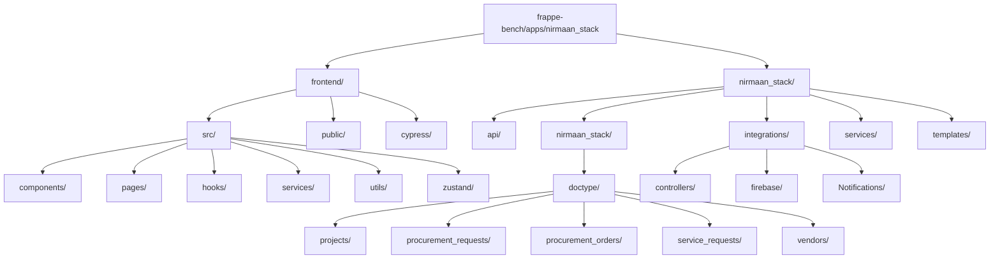
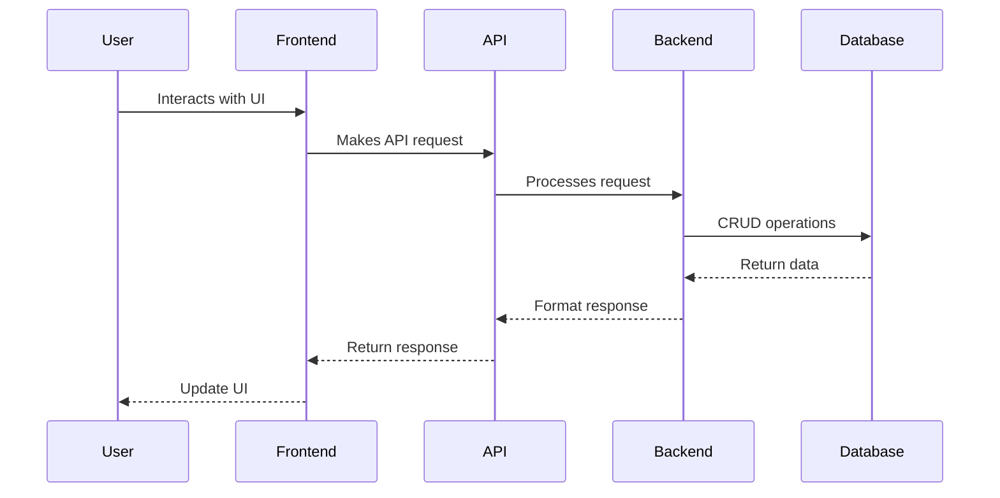
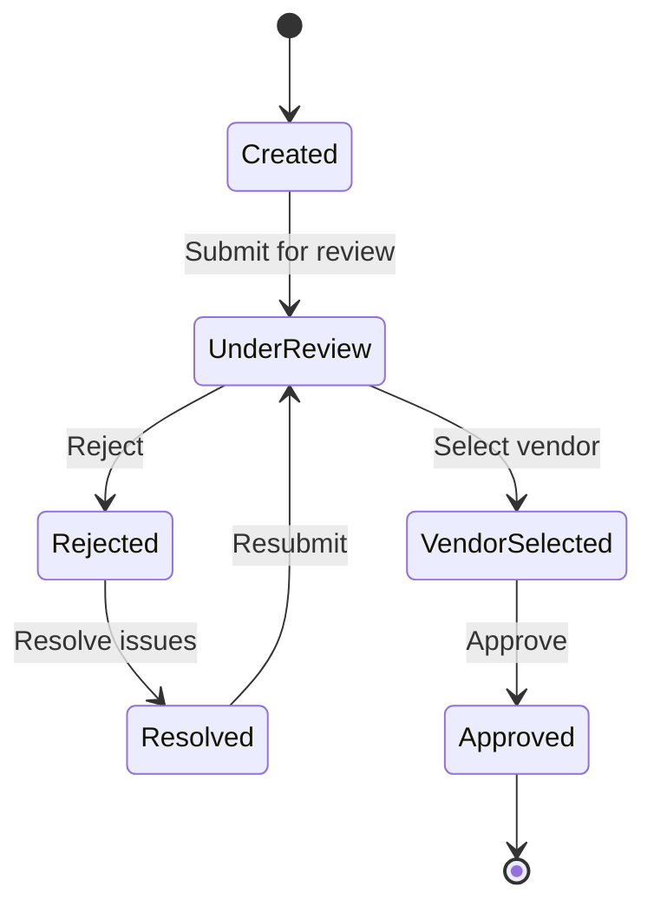
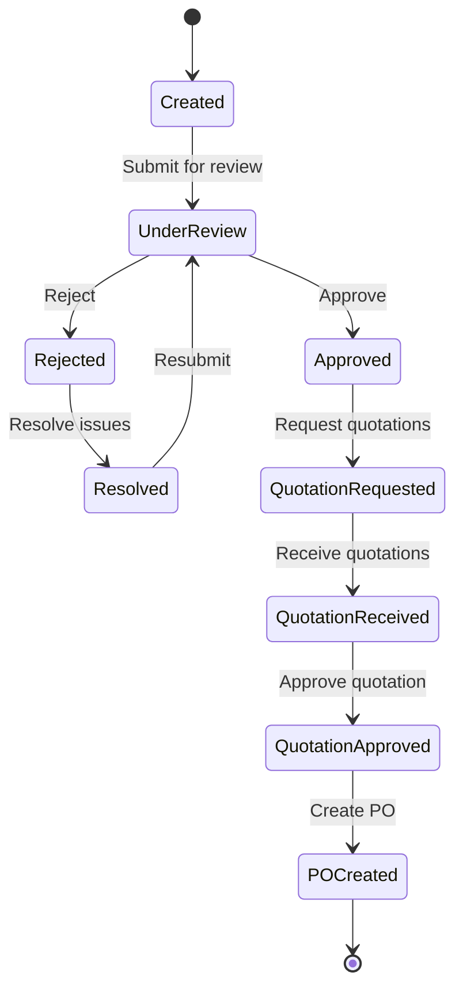
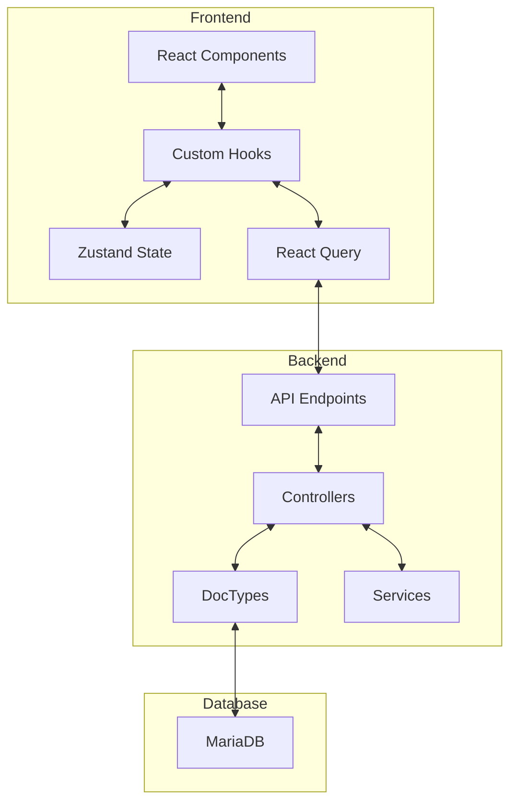
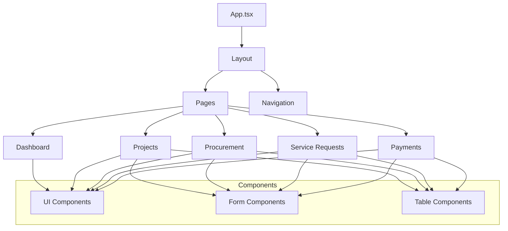
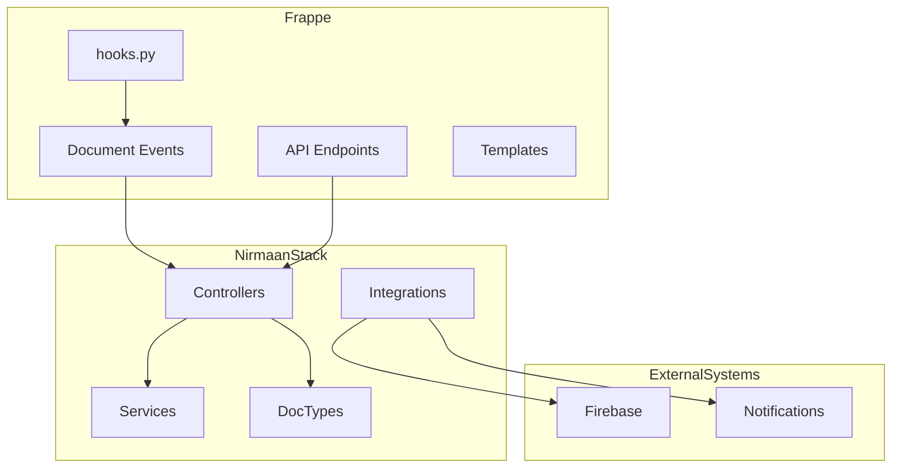

# Nirmaan Stack Architecture Diagram

This document provides visual representations of the Nirmaan Stack architecture to help developers understand the system structure and component interactions.

## Directory Structure

## Component Interaction

## Service Request Workflow

## Procurement Workflow

## Data Flow Architecture

## Frontend Component Structure

## Backend Integration Points

These diagrams provide a visual representation of the Nirmaan Stack architecture, helping developers understand the system structure and component interactions.