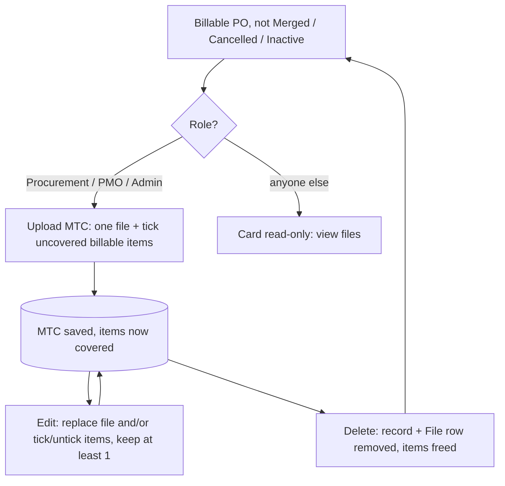
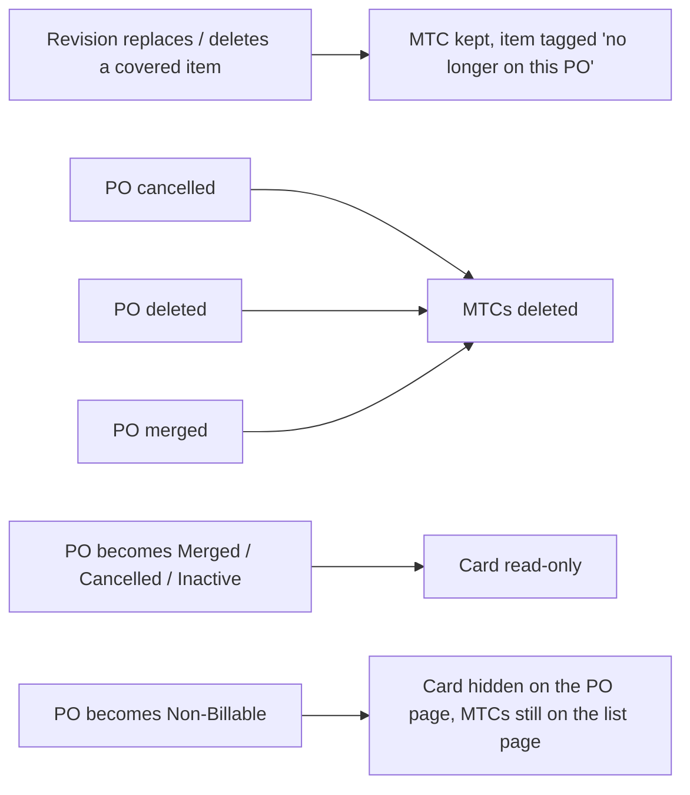

# Material Test Certificate (MTC): plan

Status: **BUILT 2026-10-07 on branch `hod/v2`, uncommitted. No browser pass has been done yet.**

Verification so far:
- Backend: 36 of 36 tests pass, rolled back, with no residue.
- `utils/mtc.test.ts`: 7 of 7 pass.
- `tsc`: 0 errors in new or changed lines.
- Residence check: F5 is 122 on committed HEAD as well (the baseline is stale), and F2 holds.

Build notes that differ from the plan below:
- The project picker does **not** carry the project over from the DC/MIR page. That project would often be greyed
  out here.
- `get_mtcs` also returns `procurement_request`, for the PM-side PO link.
- Project assignment does not gate the **upload**. Frappe checks create permission before `validate` copies the
  project from the PO. DC/MIR's endpoint also skips that check, so the PO page is the project gate.
- **Indexes.** `search_index` creates nothing on Postgres here, so `on_doctype_update` adds explicitly named
  indexes: `mtc_procurement_order_index`, `mtc_project_index` and `mtc_item_parent_index`.

Original plan, as agreed through the /grilling rounds:
The visual version, with screen mockups and diagrams, is the published artifact "Material Test Certificate Plan".

## 1. What we are building

- **A doctype, `Material Test Certificate`.** It holds one file and the billable PO items that the certificate
  covers.
- **On the PO page.** A third card, "Material Test Certificates", sits inside the "PO Attachments" accordion.
  Users can upload, view, edit and delete MTCs there.
- **On the PM and PL dashboards.** A "Material Test Certificates" card opens the **MTC list page**. You pick a
  project, then see every MTC for it. The page is view only.

## 2. Decision log

| # | Decision |
|---|---|
| Q1/Q25 → **Q39** | **Superseded 2026-10-07 by Q39:** upload, edit and delete are allowed on a **Billable** PO in **any status except Merged, Cancelled and Inactive** (PO Approved, Partially Dispatched, Dispatched, Partially Delivered and Delivered are all allowed). |
| Q2/Q27 | **Edit** can replace the file and change the items. **Delete** is also available. |
| Q3/Q24 | There are no extra fields: only the file and the items. |
| Q4 | The MTC is a record only. Nothing is blocked when an MTC is missing. |
| Q5/Q17/Q18 | **An item can be on only one MTC per PO.** The upload dialog lists only billable items that have no MTC yet. To move an item, untick it on one MTC (Edit) and tick it on another. |
| Q6 / Q35 | **Non-Billable PO: no card at all**, even if MTCs already exist; those still show on the MTC list page. **Who sees the card is the same as the DC & MIR card** (everyone who can open the PO, every status). |
| Q7/Q19/Q20/Q29 | Upload, edit and delete are allowed for **Procurement (all 4 profiles), PMO and Admin**. Everyone else sees the card read-only. |
| Q8/Q9 | The MTC list page shows one row per certificate, with a project picker. It is view only. |
| Q10 | The name is "Material Test Certificates". |
| Q11 | There is no project-page tab, report, bulk download or notification in this version. |
| Q12 | CEO Hold does not block MTC actions. |
| Q13/Q23 | `make`, `category` and `procurement_package` are saved on each item. A PO line is identified by **item + make**. |
| Q14 | When a revision replaces or deletes a covered item, the MTC is kept and the item gets a grey **"no longer on this PO"** tag. |
| Q15 | Files follow the DC/MIR rules: one file, PDF or image, up to 20 MB. The phone's file picker offers the camera. |
| Q16/Q22/Q26 | The dashboard card and the MTC list page are for **Project Manager and Project Lead only**. |
| Q21/Q28 | When a PO is **cancelled, deleted or merged**, its MTCs are deleted. |
| Q30 | Every MTC keeps at least one item. |
| Q31 | A file replaced on Edit is **kept in storage** and hidden from screens. |
| Q32 | Edit and delete follow the same rule as upload (now Q39). |
| Q33 | Edits are recorded in Frappe Version (`track_changes: 1`). Nothing new appears on screen. |
| Q34 | Delete follows DC/MIR exactly: the MTC record and the `File` row are removed (`frappe.db.delete`), and the cloud file stays in storage. |
| Q42 | The upload/edit dialog lists items as **one plain list**: no category or package group headings. It keeps "All items", search, and item + make per row (owner, 2026-10-07; supersedes the grouping in Q41). |
| Q41 | **The list page uses the app's standard DataTable:** PO No. · Vendor (facet) · Items · Certificate Date (date filter; default sort newest first) · Uploaded By (facet) · MTC Attachment ("View"). There is no Uploaded On column and no phone cards (the table scrolls). No Export. **Dialog:** PO · vendor in the header; file and date side by side; the calendar picker blocks future days, with no helper text; items grouped by Category with search (owner, 2026-10-07; supersedes the list part of Q40). |
| Q40 | **Certificate Date** field: required, no default, never in the future. Shown on the PO card next to the upload date. **MTC ids are never shown** anywhere in the UI. The list page columns are PO No. · Vendor (facet filter) · Items · Certificate Date · Uploaded On · View (owner, 2026-10-07). |
| Q36 | The list-page picker shows the user's **assigned Won projects**. Projects with MTCs can be picked and show a count, e.g. "Prestige Tech Park (3)". Projects with no MTCs are **greyed out**. |
| Q37 | A **PM with no assigned project** sees nothing: "You have not been assigned any project". The server returns no MTCs for them. |
| Q38 | A **Project Lead sees only assigned projects**, not all projects. As of 2026-10-07 none of the 3 active PLs has an assigned project, so they see the message until projects are assigned. |

## 3. Rules

1. **Who sees the card, and when.**
   - **Who:** the card is shown to the same people, in the same places, as the **DC & MIR card**. On the PO page
     that is everyone who can open the PO, in every status.
   - **Billable only:** it is shown **only on Billable POs**. On a Non-Billable PO it never shows, even if MTCs
     were uploaded before a revision made the PO Non-Billable. Those MTCs still appear on the MTC list page.
   - **When it can be changed (Q39):** Upload, Edit and Delete work on any status except `Merged`,
     `Cancelled` and `Inactive`. On those three statuses the card is read-only; with no MTCs it reads "MTCs can't be
     added to a <status> PO".
2. **What an MTC holds.** One attachment and at least one item. Each item is a **Billable** line of that PO.
3. **One MTC per item per PO.** Items are matched by `(item_id, make)`. Items already on another MTC of the PO
   are not offered. When every billable line is covered, the Upload button is disabled and says "All billable
   items have an MTC".
4. **Edit.** Edit can replace the file and tick or untick items, keeping at least one. Unticking an item frees
   it. Rows already saved on this MTC may stay even if a revision removed them from the PO; they show the tag.
   New rows must pass rule 2.
5. **Delete.** Deleting frees the MTC's items.
6. **PO cancelled, deleted or merged.** Its MTCs are deleted.
7. **Not blocked by CEO Hold.** CEO Hold does not block MTC actions, and a missing MTC blocks nothing.

## 4. Workflows

## 5. Doctype schema

### `Material Test Certificate`

- **Naming:** `MTC-.YY.-.#####`, e.g. `MTC-26-00001` (owner, 2026-10-07).
  - It restarts at 00001 every 1 January, because the counter belongs to each `MTC-<yy>-` prefix. It uses the
    calendar year, not the financial year.
  - Past 99,999 in a year it simply grows a digit (`MTC-26-100000`); nothing breaks.
  - The localhost test record created before this change keeps the name `MTC-2026-00001`.
- **Module:** Nirmaan Stack
- **`track_changes`:** 1
- **Sort:** `creation desc`

| Label | Fieldname | Type | Options | Reqd | Notes |
|---|---|---|---|---|---|
| Purchase Order | `procurement_order` | Link | Procurement Orders | 1 | `set_only_once`, `search_index`, `in_list_view`, `in_standard_filter` |
| Project | `project` | Link | Projects | 1 | `read_only`, `search_index`, `in_standard_filter`. The server copies it from the PO, so the PM's project permissions filter it. |
| Vendor | `vendor` | Link | Vendors | 0 | `read_only`. Copied from the PO. |
| Certificate File | `attachment` | Attach | | 1 | Private file, attached to the PO. |
| Items | `items` | Table | Material Test Certificate Item | 1 | At least 1 row. |

### `Material Test Certificate Item` (`istable: 1`)

| Label | Fieldname | Type | Reqd | Notes |
|---|---|---|---|---|
| Item | `item_id` | Data | 1 | `in_list_view` |
| Item Name | `item_name` | Text | 0 | `read_only`, `in_list_view`. Copied from the PO line. |
| Make | `make` | Data | 0 | `read_only`, `in_list_view`. Copied. Part of the line identity. |
| Category | `category` | Data | 0 | `read_only`. Copied. |
| Package | `procurement_package` | Data | 0 | `read_only`. Copied. |

- **Child-table index:** add an index on `parent` through `on_doctype_update`. On Postgres, Frappe v15 does not
  create a `parent` index for child tables.
- **How the doctypes are made:** create both through Desk in developer mode (or `bench new-doctype`) so that
  Frappe writes the JSON.

### Permissions

**DocPerm** (in the doctype JSON, never in a Custom DocPerm fixture):
- **Read:** every role that can read Procurement Orders.
- **Create / Write / Delete:** the roles behind the Admin, PMO and four Procurement profiles. Check the exact role
  names at build time.

**What actually enforces access:**
- **Server:** `services/role_profiles.py` gets `MTC_MANAGE_PROFILES = (ADMIN_PROFILE, PMO_EXECUTIVE_PROFILE) +
  PROCUREMENT_PROFILES` and `can_manage_mtc(user)`, with the Administrator user always passing. `validate` and
  `on_trash` both call it.
- **Frontend mirror:** `constants/roles.ts` gets `MTC_MANAGE_PROFILES` / `canManageMTC` and
  `MTC_PAGE_PROFILES = [PROJECT_MANAGER_PROFILE, PROJECT_LEAD_PROFILE]`. These are for display only.

## 6. Backend

| Piece | File | What it does |
|---|---|---|
| Line rules (pure) | `services/mtc_rules.py` | `line_key(item_id, make)` and `coverable_lines(po_items, taken_keys)`. No `frappe.db` calls. Unit-tested. |
| Controller | `integrations/controllers/material_test_certificate.py` | `validate` and `on_trash`, wired in `hooks.py` `doc_events`. |
| Endpoints | `api/material_test_certificates/mtc_api.py` | `get_mtcs`, `update_mtc` |
| PO cascade | `integrations/controllers/procurement_orders.py` → `cleanup_po_linked_docs` | Also deletes the PO's MTCs. This runs on cancel and on PO `on_trash`. |
| Merge cascade | `api/po_merge_and_unmerge.py` | Deletes the MTCs of the source POs as they become `Merged`. |

**`validate`** checks, in order:
1. The user passes `can_manage_mtc`.
2. Lock the PO row (`for_update`), so two simultaneous uploads cannot both claim the same line.
3. The PO is Billable and its status is not Merged, Cancelled or Inactive (Q39).
4. Copy `project` and `vendor` from the PO.
5. There is at least one item, and no duplicate `(item_id, make)`.
6. Every **new** row is a Billable PO line. Rows already saved on this MTC may stay.
7. No row is on another MTC of the same PO. This uses a JOIN on `procurement_order`, excluding `self.name`.
8. Copy `item_name`, `make`, `category` and `procurement_package` from the PO line.

**`on_trash`:**
1. Unless the delete is a PO cascade, check `can_manage_mtc` and the status rule. The cascade sets
   `flags.from_po_cleanup`.
2. Remove the `File` row with `frappe.db.delete("File", {"file_url": url, "attached_to_name": po})`, exactly as
   DC/MIR does. The cloud file stays.

**Strict project scope for PM and PL** (shared helper `mtc_allowed_projects(user)`):
- For a PM or PL profile, the allowed projects are exactly their `User Permission` rows with
  `allow = "Projects"`.
- **No rows means no projects.** Frappe's default would show every project; we don't follow it here.
- Every other profile keeps Frappe's normal behaviour.

**`get_mtc_projects()`** (drives the list-page picker):
- Returns `[{project, mtc_count}]`, grouped from the MTC records in one `GROUP BY` and limited to the allowed
  projects.
- The picker (the existing `ProjectSelect`, Won projects only) uses this as its `eligibleProjects` map. Projects
  that aren't in it are greyed out, and the label carries the count.

**`get_mtcs(procurement_order=None, project=None)`:**
- Exactly one argument is required.
- With `project`, a PM or PL gets an empty list for any project outside their allowed set.
- Fetch the parents with `frappe.get_list`, which respects user permissions.
- Fetch the child rows with one `frappe.get_all(..., parent in names)`.
- Return newest first: `[{name, procurement_order, project, vendor, vendor_name, attachment, owner, creation,
  items:[{item_id, item_name, make, category, procurement_package}]}]`.

**`update_mtc(name, items, attachment=None)`:**
- Load the doc, replace its `items`, and set the new `attachment` if one is given. Then `doc.save()`, which runs
  `validate` and writes a Version row.
- The old `File` row is **not** touched, so the replaced file is kept.
- It is an endpoint rather than a raw `updateDoc` because of residence rule F5.

**Create and delete:**
- **Create** uses the SDK: `useFrappeFileUpload`, attached to the PO with `isPrivate: true`, then `createDoc` with
  the child rows inline.
- **Delete** uses the SDK `deleteDoc`. `on_trash` does the checks.

## 7. Frontend

**New:**
- `types/NirmaanStack/MaterialTestCertificate.ts`
- `utils/mtc.ts`: `lineKey` and `coverableLines`, mirroring `services/mtc_rules.py`. Tested in `mtc.test.ts`.
- `pages/MaterialTestCertificates/MaterialTestCertificates.tsx` + `index.ts`: the MTC list page.
- `pages/MaterialTestCertificates/components/`:
  - `MTCCard.tsx`: the PO-page card.
  - `MTCTable.tsx`
  - `MTCListCards.tsx`: the mobile layout.
  - `UploadMTCDialog.tsx`: create and edit modes.
  - `MTCItemChecklist.tsx`
- `pages/MaterialTestCertificates/hooks/`:
  - `useMTCs.ts`: `useFrappeGetCall` on `get_mtcs`, with a shared key.
  - `useMTCMutations.ts`

**Edited:**
- `ProcurementOrders/invoices-and-dcs/DocumentAttachments.tsx`: renders `<MTCCard>` as a full-width row.
- `ProcurementOrders/purchase-order/PurchaseOrder.tsx`: adds "MTCs: n" to the accordion header.
- `components/layout/dashboards/dashboard-pm.tsx` and `dashboard-pl.tsx`: add the card.
- `components/helpers/routesConfig.tsx`: adds `prs&milestones/material-test-certificates`, wrapped in
  `<RoleRoute allowed={MTC_PAGE_PROFILES}>`.
- `constants/roles.ts`: the new profile constants.

## 8. Screens (summary; the artifact has the full mockups)

- **PO page, Procurement / PMO / Admin view.**
  - The header gets `MTCs: n`.
  - Columns: S.No · Date · Items (first 2 + "+N more", with tags) · Uploaded By · View / Edit / Delete.
  - Upload MTC sits in the card header.
- **PO page, everyone else** (the same people who see the DC & MIR card). The same card without Upload, Edit or
  Delete.
- **PO page, billable PO before Partially Delivered.** The card shows the empty state "MTCs can be uploaded once
  the PO is Partially Delivered" and has no Upload button.
- **PO page, Non-Billable PO.** There is no card.
- **Upload dialog.**
  - One file (PDF or image, up to 20 MB).
  - A checklist of uncovered billable lines showing name, make, category and package, with "Select all".
  - At least one item must be ticked.
- **Edit dialog.**
  - The current file with View and Replace.
  - This MTC's items come ticked, with any tags shown. Uncovered billable lines are offered unticked.
  - At least one item must stay ticked.
- **Delete confirmation.** Reads "The N items it covers become free for a new MTC."
- **Dashboards (PM and PL).** A "Material Test Certificates" card.
- **MTC list page.**
  - **Project picker:** the plain shared `ProjectSelect`, exactly like the DC & MIR page (owner, 2026-10-07; this
    superseded Q36's greyed-out list). The selection is shared through `UserContext` and session storage, and
    `project-select.tsx` is unchanged.
  - A PM or PL with no assigned project sees "You have not been assigned any project".
  - A search over item, PO and vendor.
  - A summary line: "N certificates · N POs · N items covered".
  - Columns (2026-10-07 redesign):
    - Certificate: the MTC number, with the file name and a view link under it.
    - PO / Vendor: the PO link, with the vendor on one line under it (cut off, full name on hover).
    - Items covered: an "N items" count, then chips "name · make", showing 3 and then "+N more".
    - Uploaded: the date, with "by <name>" under it.
    - Certificate, PO and Uploaded are sortable; the default is newest first. There is no S.No.
  - Cards on mobile, with the same content.
  - The PO page card keeps its own layout.

## 9. Build slices

1. **Backend.**
   - The doctypes, role helper, pure rules, controller, endpoints and the PO and merge cascades.
   - Backend tests.
   - Then **you run `bench migrate`**.
2. **PO page.** The card, the upload/edit dialog, delete, and the header count.
3. **Dashboards and the MTC list page,** with the route guard.
4. **Checks.**
   - `tsc` on the changed files, the `vitest` test for `utils/mtc.ts`, and `scripts/residence_check.py`.
   - A browser pass in incognito Chrome. I'll ask for a test login first.

## 10. Test matrix

**Backend** (rolled back, own fixtures only):
- Refused: Non-Billable PO; PO in Dispatched or PO Approved; a Non-Billable line; a line not on the PO; zero
  items; a duplicate line.
- A line already on another MTC of the same PO is refused. Two MTCs racing for the same line: one wins, one is
  refused.
- `project`, `vendor`, `make`, `category` and `package` are taken from the PO even when the payload is tampered
  with.
- Edit can untick a line, which frees it so another MTC can claim it.
- Edit refuses unticking every item.
- Edit keeps a row that a revision removed from the PO.
- Replacing the file keeps the old `File` row, and a Version row is written.
- A PM can't create, edit or delete. Procurement can.
- Deleting removes the `File` row and frees the items.
- Cancelling, deleting or merging a PO removes its MTCs.
- `get_mtc_projects` returns only the assigned projects for a PM or PL, and nothing for a PM or PL with no
  assigned project.
- `get_mtcs(project=B)` returns nothing for a PM assigned only to project A. Passing both arguments or neither
  raises an error.

**Browser:**
- Procurement uploads, edits and deletes on a Delivered PO.
- A PM sees a read-only card.
- A billable Dispatched PO shows the card with the empty state and no Upload button.
- A Non-Billable PO shows no card, even when MTCs exist. Those MTCs still show on the MTC list page.
- Everyone who sees the DC & MIR card also sees the MTC card.
- The dashboard card and the MTC list page work as PM and as PL. Accountant is redirected away from the page.
- In the picker, only assigned Won projects appear. Those without MTCs are greyed out, and those with MTCs show a
  count.
- A PM or PL with no assigned project sees the message. Calling the API directly also returns nothing.
- At mobile width the dialog scrolls and the list shows cards.

## 11. Not in this version

- Moving items between MTCs in one step
- A project-page tab, a report, bulk download, or notifications
- Work Orders and ITMs
- Fixing the DC/MIR delete comment, which wrongly says the delete removes the cloud file
