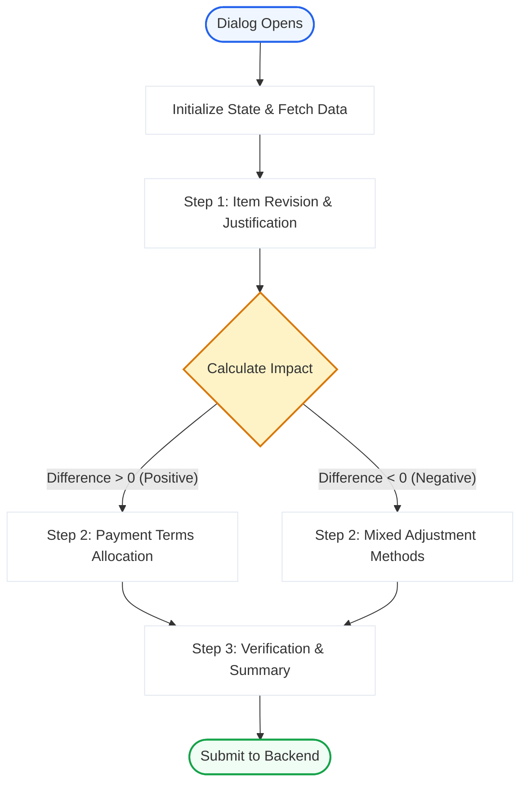
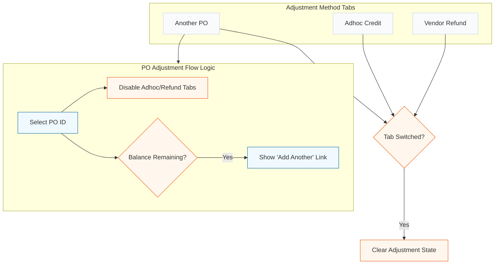

# PO Revision Creation Data Structure & Logic Flow

This document provides a comprehensive overview of the PO Revision creation process, detailing the logic for data fetching, step-by-step rendering, and backend integration.

## Table of Contents
1. [Core Components](#core-components)
2. [Data Flow & State Management](#data-flow--state-management)
3. [Step-by-Step Logic](#step-by-step-logic)
4. [Financial Calculations](#financial-calculations)
5. [Backend Integration](#backend-integration)

---

```markdown
## Core Components

The PO Revision module is structured into three main layers:

- **Orchestrator (`PORevisionDialog.tsx`)**: Manages the high-level step transitions and layouts.
- **State Manager (`usePORevision.ts`)**: A custom hook that centralizes all revision state, financial calculations, and API calls.
- **Step Components**:
  - **`Step1ReviseItems`**: Line item editing and justification.
  - **`Step2PositiveFlow`**: Allocation of extra costs to payment terms.
  - **`Step2NegativeFlow`**: Mixed adjustment handling for refunds (Adhoc, Vendor Refund, PO Adjustment).
  - **`Step3Summary`**: Final review of all changes and impacts.

---
```

## Data Flow & State Management

The entire module revolves around the `difference.inclGst` calculation, which determines whether the revision is a **Positive Flow** (Cost Increase) or a **Negative Flow** (Refund/Cost Decrease).

- `difference`: Object containing `exclGst` and `inclGst` deltas. This object is the "Brain" of the module; it dictates whether Step 2 shows the **Positive** or **Negative** flow.

### Data Fetching Logic
To support revisions, the `usePORevision` hook reactively fetches related data:

- **Vendor Invoices**: Fetched for the current PO to show payment/invoice context in Step 1.
- **Candidate POs (`adjCandidatePOs`)**: Fetched for **Negative Flows** to allow adjustments against other balances.
  - **Source**: `Procurement Orders`
  - **Filters**:
    1. `vendor`: Must match the vendor of the PO being revised.
    2. `status`: Must be `PO Approved`.
  - **Fields**: `name`, `total_amount`, `amount_paid`.
  - **Usage**: Used in `Step2NegativeFlow` to calculate `maxPayableForThisPO = (total_amount - amount_paid)`.

## Logic Flow Diagrams

### High-Level Orchestration


### Item Revision Logic (Step 1)
When an item is modified, the `item_type` transitions as follows:
- **Modified Original**: `Original` → `Revised` (Maintains `original_row_id` for backend diffing).
- **Removed Original**: `Original` → `Deleted` (Hidden in UI, but sent to backend for removal).
- **Added Item**: `New` (New row with no original reference).
- **Cancelled Revision**: `Deleted` → `Original` (If the user undoes a deletion).

### Mixed Adjustment Interaction (Step 2 Negative)
The interaction logic ensures that the strategy is consistent and clear:



---

## Step-by-Step Logic

### Step 1: Revise Items
Users can Add, Edit, or Delete line items.
- **Deletion**: Original items are marked as `item_type: "Deleted"` rather than being removed from state to maintain history.
- **New Items**: Items added during revision are marked as `item_type: "New"`.
- **Validation**: Requires a non-empty `justification` to proceed.

### Step 2: Allocation & Adjustments
Based on the `difference.inclGst`:

#### Positive Flow (`difference.inclGst > 0`)
The extra amount must be fully allocated to new or existing payment terms. Validation ensures `totalPaymentTerms === difference.inclGst`.

#### Negative Flow (`difference.inclGst < 0`)
Supports simultaneous adjustment methods:
1.  **Another PO**: Adjust against outstanding balances of other approved POs for the same vendor.
2.  **Ad-hoc Credit**: Create a credit note for internal tracking (e.g., price correction).
3.  **Vendor Refund**: Track direct refunds with date and file proof.

**Logic Highlights**:
- Tabs for "Adhoc" and "Refund" are disabled if a PO is currently selected to maintain flow consistency.
- Switching primary tabs resets the adjustment state to prevent data leakage.
- Mixed methods are added via the "Add Another Adjustment Method" dialog when a balance remains.

### Step 3: Summary
A read-only view that aggregates:
- Changed line items with "Original → Revised" diffs.
- Detailed financial impact (Subtotal, GST, Total).
- Allocation/Adjustment details for transparency.

---

## Financial Calculations

Calculations are memoized in `usePORevision` to ensure real-time UI updates:
- **`beforeSummary`**: Pre-revision totals.
- **`afterSummary`**: Totals based on current `revisionItems`.
- **`difference`**: `afterSummary - beforeSummary`.
- **`totalAdjustmentAllocated`**: Sum of all `refundAdjustments`.

---

### Backend Submission Structure
The `handleSave` function in `usePORevision` transforms the state into a strictly defined JSON structure for the Frappe backend.

- **`revision_items`**: A flat list of items where each entry contains both current values and original values for server-side delta processing.
  - **`item_type` logic**:
    - `Original`: No changes; used as a baseline.
    - `Revised`: Rate, quantity, or other attributes changed.
    - `New`: Completely new line item.
    - `Deleted`: Item removed in revision (not yet removed from DB).

## Backend Creation Logic

When `make_po_revisions` is called, the backend executes the following steps to create the **PO Revision** record:

### 1. Document Initialization
Creates a new `PO Revisions` draft linked to the original `Procurement Orders`. It copies over metadata like Project and Vendor.

### 2. Item Processing (`revision_items`)
The backend iterates through the items sent from the frontend. The `item_type` determines how fields are mapped:

| Item Type | Original Data Populated? | Revision Data Populated? | Backend Action (on Approval) |
| :--- | :--- | :--- | :--- |
| **Original** | Yes | No | None (Baseline reference) |
| **New** | No | Yes | Appends new row to Original PO |
| **Revised** | Yes | Yes | Updates existing row in Original PO |
| **Deleted** | Yes | No | Removes row from Original PO |

### 3. Financial Payload (`payment_return_details`)
The JSON structure is saved directly to the `payment_return_details` field. On **Approval**, the backend parses this JSON to:
- Create **Project Payments** for Negative flows (Adjustments/Refunds).
- Update and approve **Payment Terms** for Positive flows.

## Approval Flow (Financial Impact)
Upon approval, the backend creates "ledger entries" in the form of `Project Payments`:
- **Adjustment Out/In**: Created when using `Against-po`.
- **Return/Refund**: Created for direct bank refunds.
- **Ad-hoc Adjustment**: Created for internal credit notes.

## JSON Schema: payment_return_details

The following examples show the exact structure of the `payment_return_details` field for different flows.

### 1. Positive Flow (Payment Terms)
Used when the revision results in a cost increase.
```json
{
  "list": {
    "type": "Payment Terms",
    "Details": [
      {
        "return_type": "Payment-terms",
        "status": "Pending",
        "amount": 5000,
        "terms": [
          { "label": "Advance Payment", "amount": 2000 },
          { "label": "On Delivery", "amount": 3000 }
        ]
      }
    ]
  }
}
```

### 2. Negative Flow (Refund Adjustments)
Used when the revision results in a cost decrease. This can contain multiple mixed methods.
```json
{
  "list": {
    "type": "Refund Adjustment",
    "Details": [
      {
        "return_type": "Against-po",
        "status": "Pending",
        "amount": 1500,
        "target_pos": [
          { "po_number": "PO/123/0001", "amount": 1500 }
        ]
      },
      {
        "return_type": "Ad-hoc",
        "status": "Pending",
        "amount": 500,
        "ad-hoc_tyep": "expense",
        "ad-hoc_dexription": "material_damage",
        "comment": "Damaged goods in transit"
      },
      {
        "return_type": "Vendor-has-refund",
        "status": "Pending",
        "amount": 1000,
        "refund_date": "2024-02-24",
        "refund_attachment": "/private/files/refund_receipt.pdf"
      }
    ]
  }
}
```

> [!NOTE]
> For Vendor Refunds, files are uploaded via `useFrappeFileUpload` before the final submission, and the resulting file URLs are included in the `payment_return_details`.
